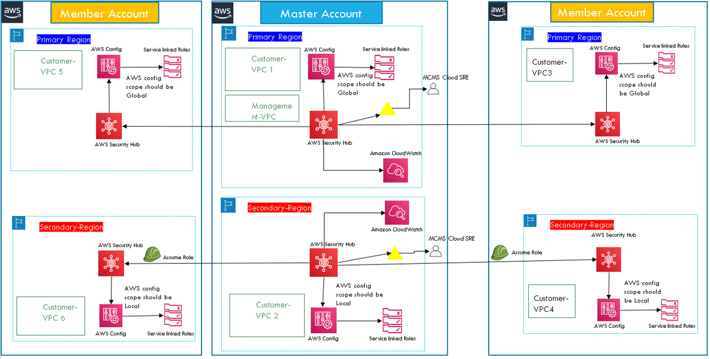
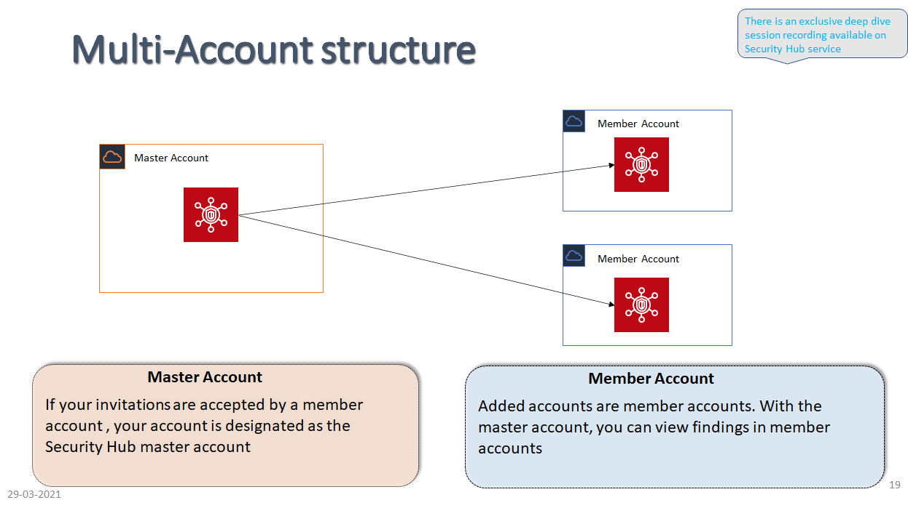

# aws_security_hub_automation

# AWS Security Hub Onboarding, Automation

## Context / User story
This repo contains SecurityHub onboarding artifacts.

## Architecture
Multi Account, Multi Region Reference Architecture


Multi Account Reference Architecture


## Objective
This repo contains SecurityHub onboarding artifacts.

Goal is to first automate the deployment of above reference architecture for customers. This repository contains artifacts related to that automation.

The following CIS controls are covered in the solution now:
```
CIS.1.13
CIS.1.14
```

## Requirements
None

## Variables (Configured as extra variables in Job Template)
```
Variables to be input by customers. Refer config.yml for the configuration parameters. 
```

## How to configure, execute the scan


## Outcomes


## Other Info
Please check the "PublicCloudSecurity_MVP1 V0.4.pptx" presentation for more details about this solution.

## Authors information (in alphabetic order)

Name | eMail
-----|------
Alwyn Lobo | lalwyn@in.ibm.com
Alexander Keller| alexk@us.ibm.com
Jigar Kapasi | kjigar@in.ibm.com
Pradeep Chandrasekhar | pradeepch@in.ibm.com
Venkat Reddy | venkatre@in.ibm.com